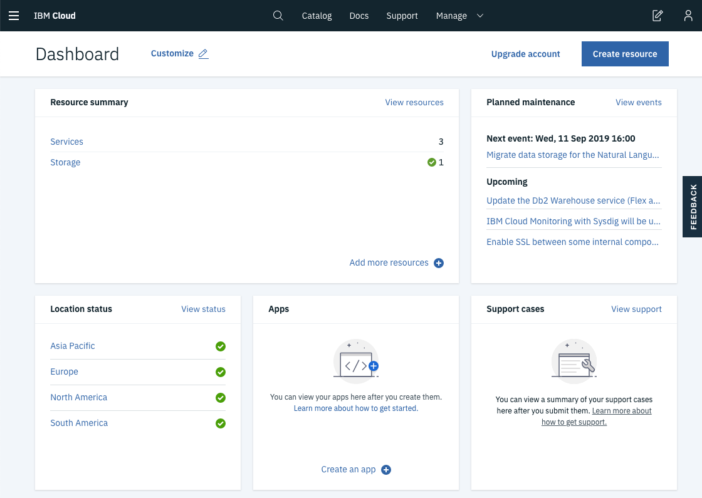
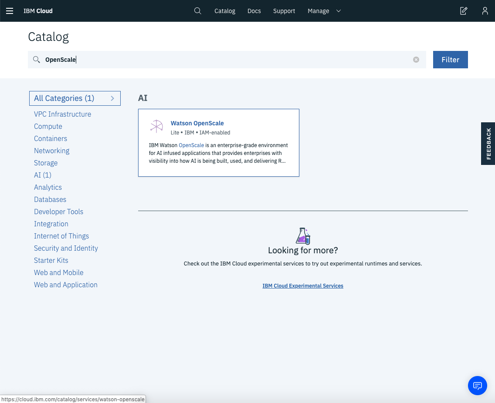
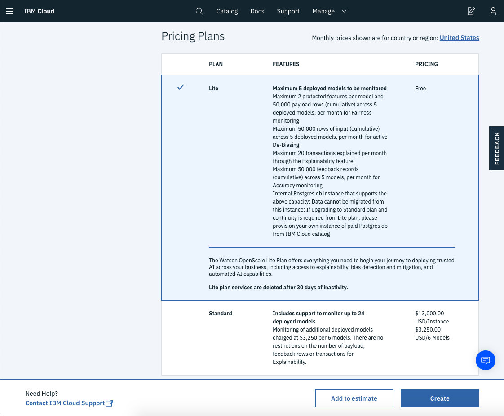

# Workshops Prerequisites

# github.com/pmservice/OpenScale-Labs/ --> ThinkSummitWarsaw

## Registering Watson Studio Account

Open a browser window and navigate to: https://dataplatform.cloud.ibm.com/registration/stepone?context=wdp&apps=all

Select "Dallas" region, then provide your email address and "Create an IBM Cloud Account" or "Log in to activate Watson".

Fill in the registration form and follow the link in the validation email when it arrives.

In case of troubles visit: https://dataplatform.cloud.ibm.com/docs/content/wsj/getting-started/signup-wdp.html?audience=wdp&context=wdp&linkInPage=true

## Provision Watson OpenScale Service

[Login into IBM Cloud](https://cloud.ibm.com/login) using the account credentials you have registered.

Click on [Create Resource](https://cloud.ibm.com/catalog?search=label:lite) to navigate to the IBM Cloud catalog. 

Select "Watson OpenScale" from the available services.

Provision the new service in the "Lite" pricing plan.

## Log into Watson Studio

Open a browser window and navigate to: https://dataplatform.cloud.ibm.com

Login into Watson Studio using the account credentials you have registered.

