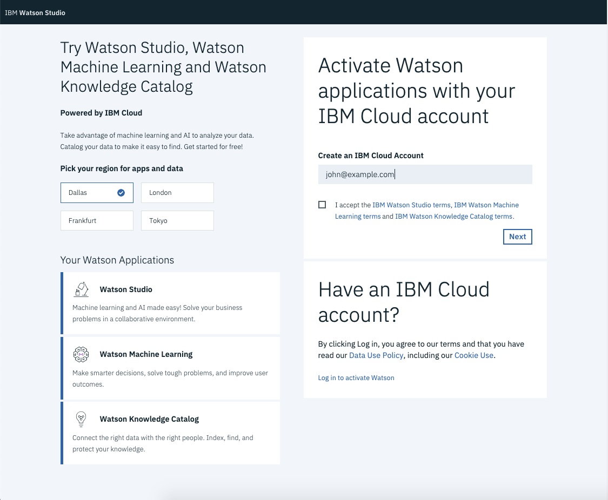
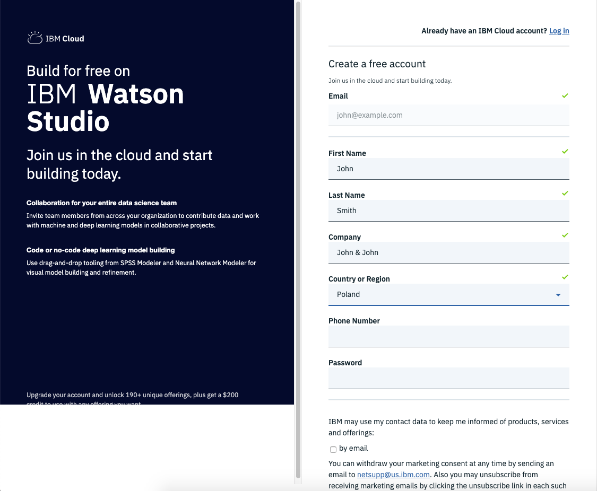

# Workshops Prerequisites

## Registering Watson Studio Account

Open a browser window and navigate to: https://dataplatform.cloud.ibm.com/registration/stepone?context=wdp&apps=all

Select "Dallas" region, then provide your email address and "Create an IBM Cloud Account" or "Log in to activate Watson".

Fill in the registration form and follow the link in the validation email when it arrives.

In case of troubles visit: https://dataplatform.cloud.ibm.com/docs/content/wsj/getting-started/signup-wdp.html?audience=wdp&context=wdp&linkInPage=true

## Log into Watson Studio

Open a browser window and navigate to: https://dataplatform.cloud.ibm.com

Login into Watson Studio using the account credentials you have registered.

