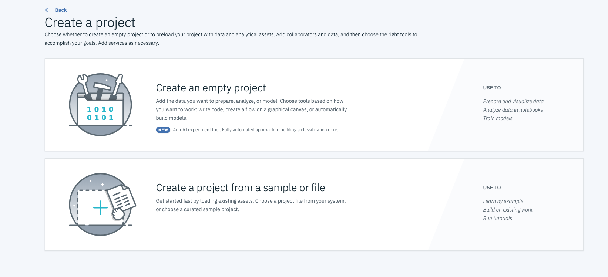
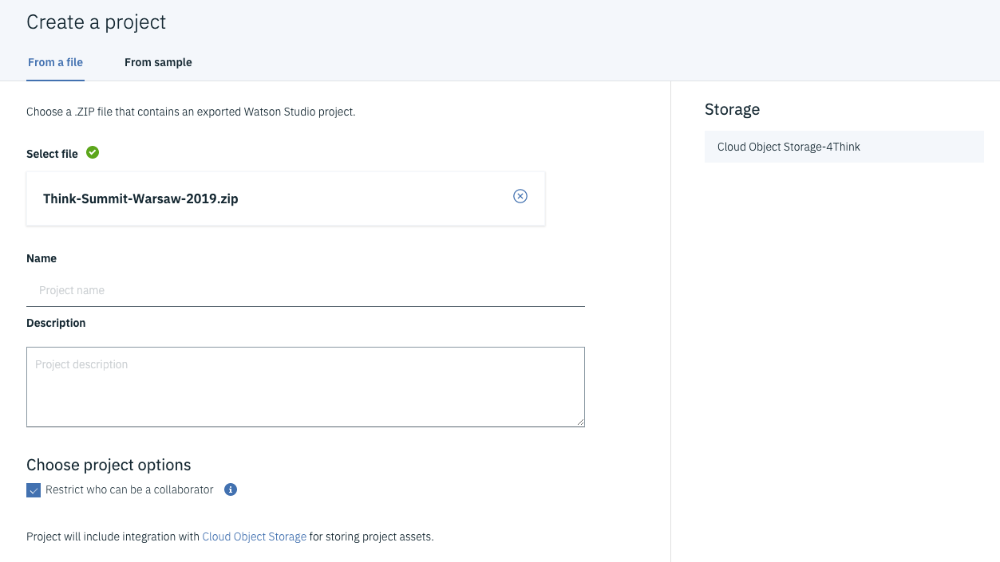
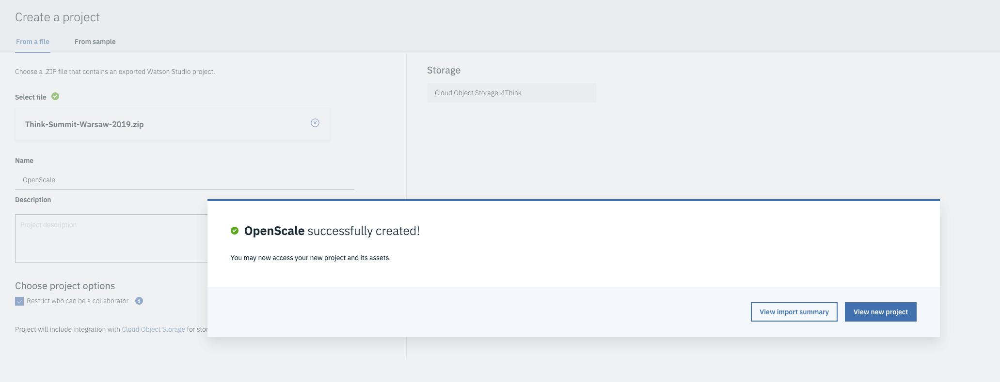
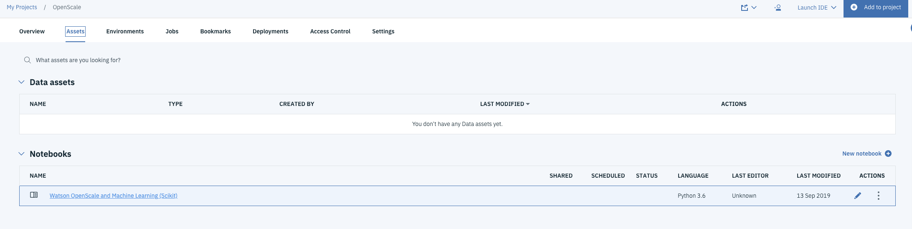
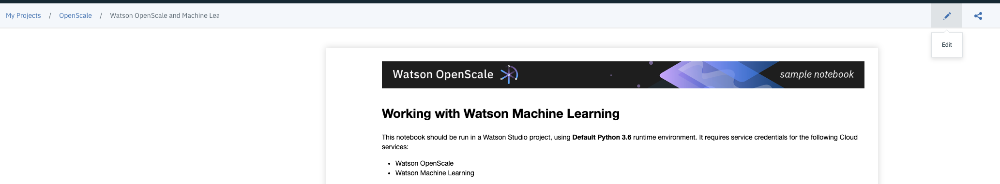

# Workshop

## Workshop Prerequisites
[Make sure you have completed the Prerequisites before moving to next session](https://github.com/pmservice/OpenScale-Labs/blob/master/ThinkSummitWarsaw/00-prerequisites.md)

---

## Workshop Instructions

### Import project to Watson Studio
1. Download the [Watson Studio project zip file](https://github.com/pmservice/OpenScale-Labs/raw/master/ThinkSummitWarsaw/Think-Summit-Warsaw-2019.zip)
2. Create new project by navigating to [New Project](https://dataplatform.cloud.ibm.com/projects/new-project?context=analytics)
3. Select **Create a project from a sample or file**

4. Drag and drop download project zip file
5. Type the name and press **Create**

6. Press **View New Project** button

### Run the notebook
1. Under Assets - Notebooks section you will find **Watson OpenScale and Machine Learning (Scikit)** notebook

2. Open the notebook by clicking on notebook name
3. Edit the notebook by pressing edit button (pencil icon)

4. Run the notebook cells by pressing play button
